<div align="center">

# 🌌 LIFEOS

### **Understand. Decide. Adapt.**
#### *The On-Device Adaptive Personal Intelligence & Decentralized Resilience Platform for Android*

[-3DDC84?style=for-the-badge&logo=android&logoColor=white)](https://developer.android.com)
[](https://kotlinlang.org)
[](https://developer.android.com/jetpack/compose)
[](https://developer.android.com/training/data-storage/room)
[-00C853?style=for-the-badge&logo=checkmarx&logoColor=white)](app/build/reports/tests/testDebugUnitTest/index.html)
[](#security--privacy-hardening)

<p align="center">
  <b>100% Local Heuristic Decision Engine</b> • 
  <b>Deterministic Fact Corroboration</b> • 
  <b>Store-and-Forward Mesh Resilience</b>
</p>

---

</div>

## 💡 Executive Overview

Modern smartphone experiences are fractured: personal data is harvested into cloud silos, productivity apps rely on black-box generative AI prone to hallucination, and life-critical communication collapses the moment cellular towers fail.

**LIFEOS** is an adaptive, privacy-first mobile operating layer built from the ground up to restore sovereignty to the user. Operating **100% on-device** with zero telemetry or cloud dependencies, LIFEOS integrates three core intelligence pillars:

1. **Personal Intelligence**: A closed-loop cognitive engine that models individual focus patterns, circadian energy peaks, and task velocity to proactively surface what matters most right now.
2. **Trust Intelligence (RealityCheck)**: A deterministic fact-corroboration engine that cross-references assertions against verified institutional corpora with explainable scoring and zero generative hallucinations.
3. **Resilience Intelligence (RescueMesh)**: A decentralized store-and-forward peer-to-peer message protocol featuring cryptographic SHA-256 fingerprinting, bounded-hop propagation, strict TTL prioritization, and opportunistic gateway sync.

---

## 📸 Visual Showcase

### Phase 1: Personal Intelligence & Strategic Execution

| 01. Command Center Dashboard | 02. Prioritized Action Queue |
| :---: | :---: |
| 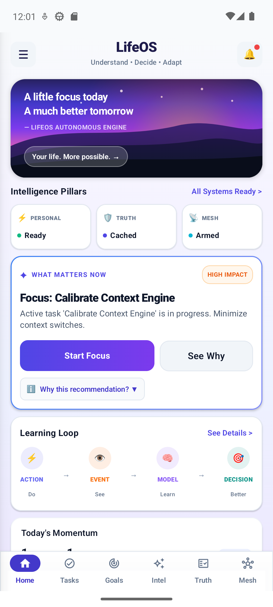 | 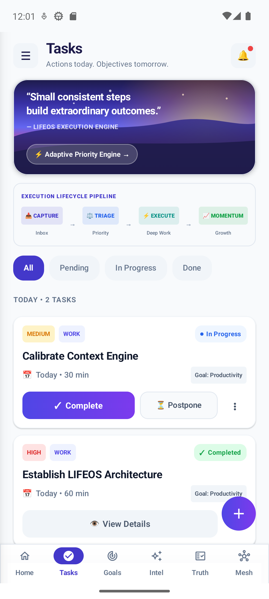 |
| **Command Center Dashboard**<br/>Atmospheric mountain sunrise canvas, active context recommendation capsule, 2×2 live telemetry grid, real-time momentum tracker, and closed-loop behavior model. | **Action Queue**<br/>Contextual task list with dynamic status pills (`All`, `Pending`, `In Progress`, `Done`), category tags, inline completion controls, and quick action postponement. |

| 03. Rapid Task Authoring | 04. Strategic Alignment Hierarchy |
| :---: | :---: |
| 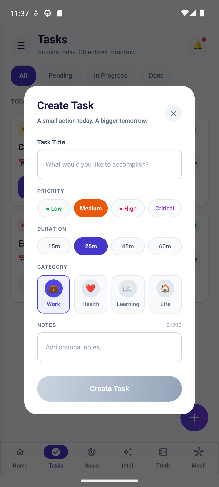 | 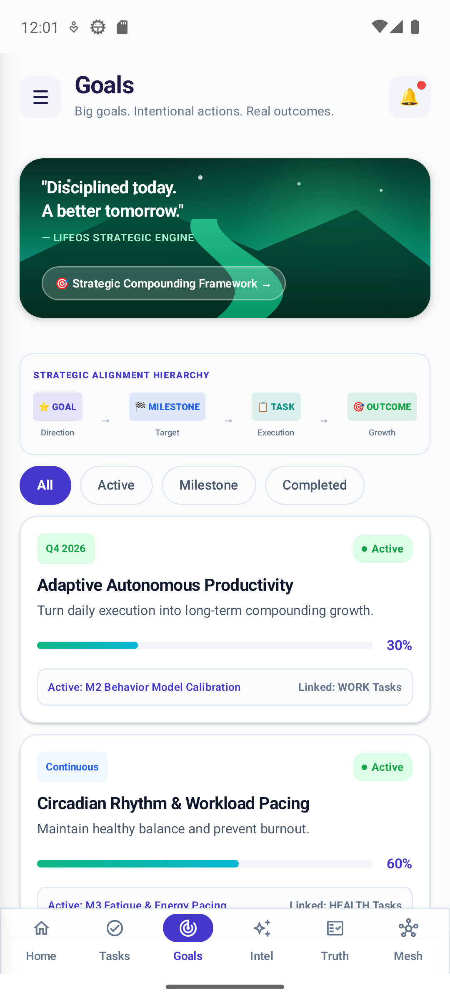 |
| **Task Authoring Modal**<br/>Modal bottom sheet with single-tap priority tiers (`Low`, `Medium`, `High`, `Critical`), time-budget presets (`15m`, `25m`, `45m`, `60m`), and categorized goal linkage. | **Strategic Goals Hierarchy**<br/>Scenic winding trail banner, multi-quarter milestone progression bars, and direct mathematical alignment connecting daily execution to compounding vision. |

---

### Phase 2: Cognitive Architecture & Truth Intelligence

| 05. 6-Stage Cognitive Closed Loop | 06. RealityCheck Inquiry Hub |
| :---: | :---: |
| 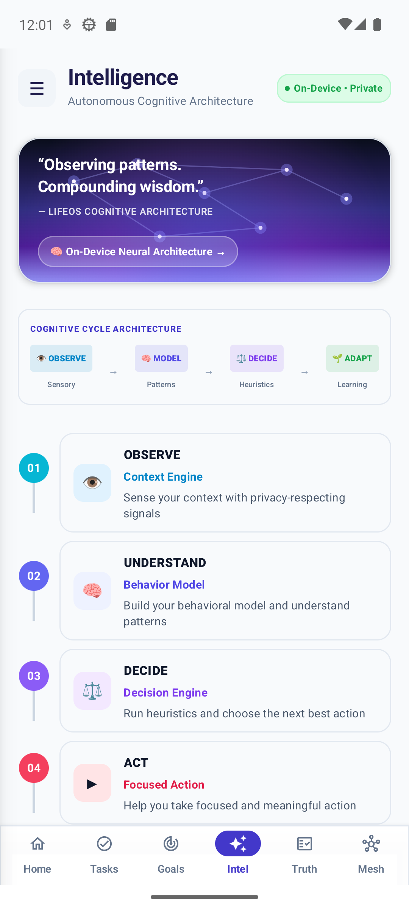 | 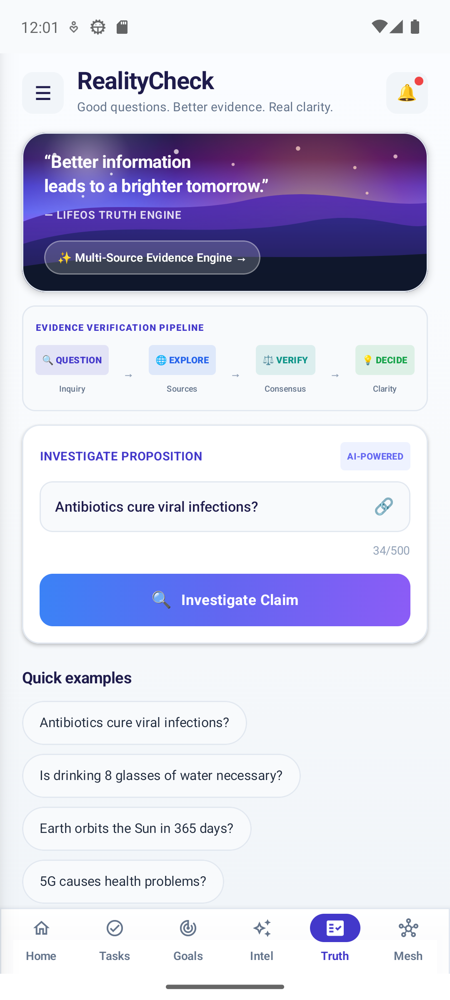 |
| **Cognitive Engine Architecture**<br/>Visualizing the six on-device stages: `01 OBSERVE`, `02 UNDERSTAND`, `03 DECIDE`, `04 ACT`, `05 MEASURE`, and `06 ADAPT` anchored by on-device privacy principles. | **RealityCheck Claim Entry**<br/>Text input with link recognition, curated one-tap scientific/historical claim chips, and verified audit history records. |

| 07. Corroborated Truth Report | 08. RescueMesh Network Center |
| :---: | :---: |
| 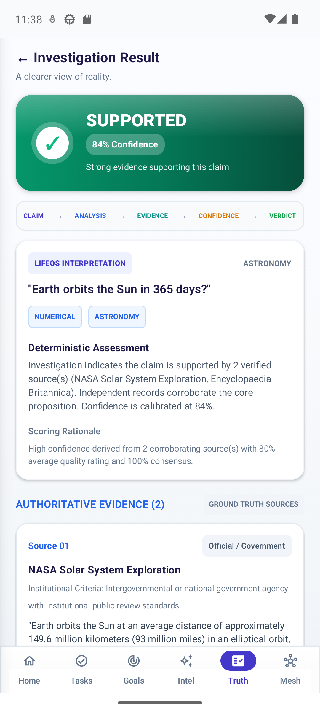 | 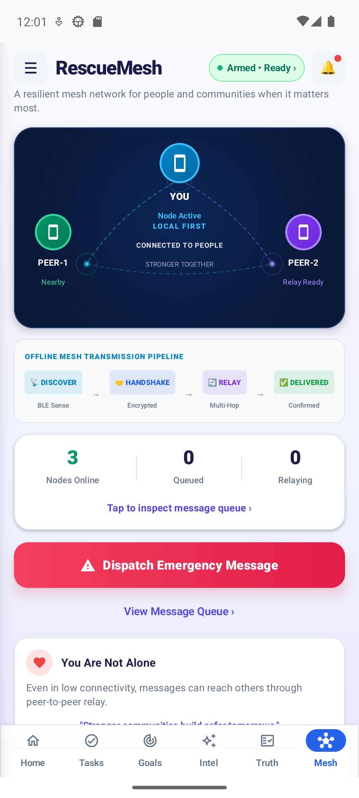 |
| **Investigation Verdict Report**<br/>Deterministic verdict banner (`SUPPORTED`, `CONTRADICTED`, `MIXED`), calibrated confidence rating (e.g. 84%), scoring rationale, and authoritative source evidence cards. | **RescueMesh Topology Visualization**<br/>Dynamic 3-node peer-to-peer network graph, live transmission telemetry (`Nodes Online`, `Queued`, `Relaying`), and instant emergency SOS dispatch. |

---

### Phase 3: Resilience Operations & System Adaptability

| 09. Offline Emergency SOS Dispatch | 10. Store-and-Forward Message Queue |
| :---: | :---: |
| 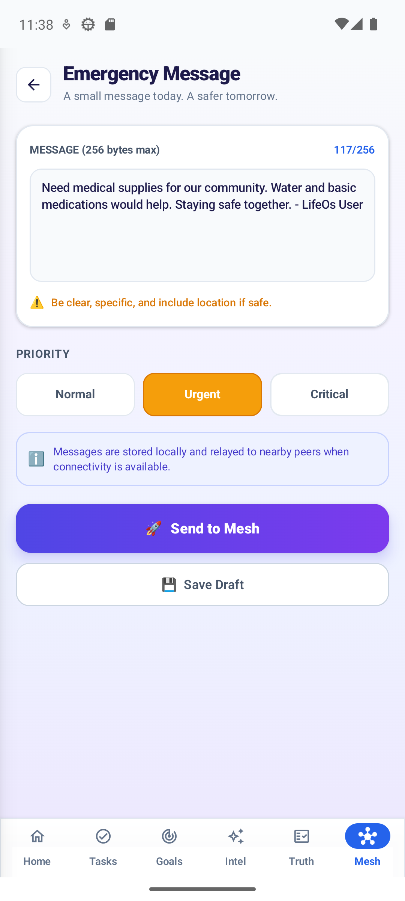 | 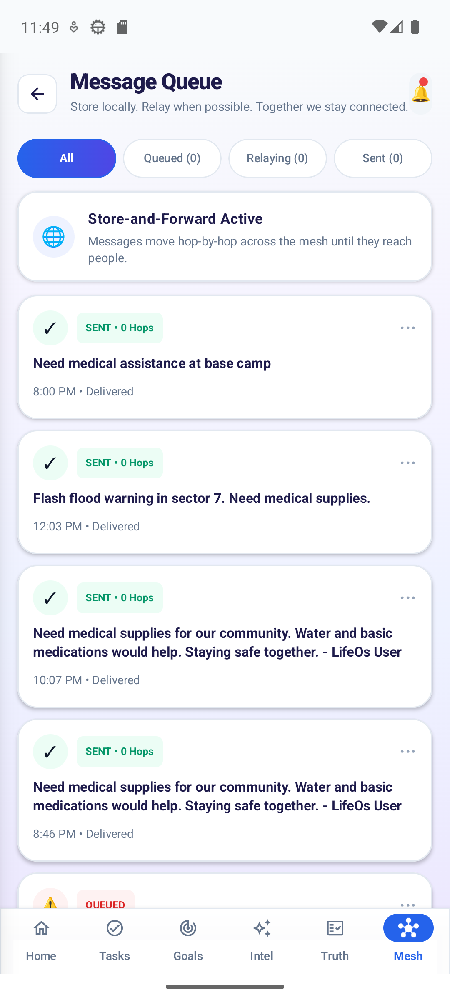 |
| **Emergency SOS Dispatcher**<br/>Triage priority classification (`Normal`, `Urgent`, `Critical`), 256-byte bounded safety payload, local store-and-forward confirmation, and immediate draft persistence. | **Store-and-Forward Queue**<br/>Cryptographically verified packets with hop-count telemetry (`SENT • 0 Hops`), delivery timestamps, status filtering, and opportunistic transmission triggers. |

| 11. Notification Audit Center | 12. Adaptive Navigation Drawer |
| :---: | :---: |
| 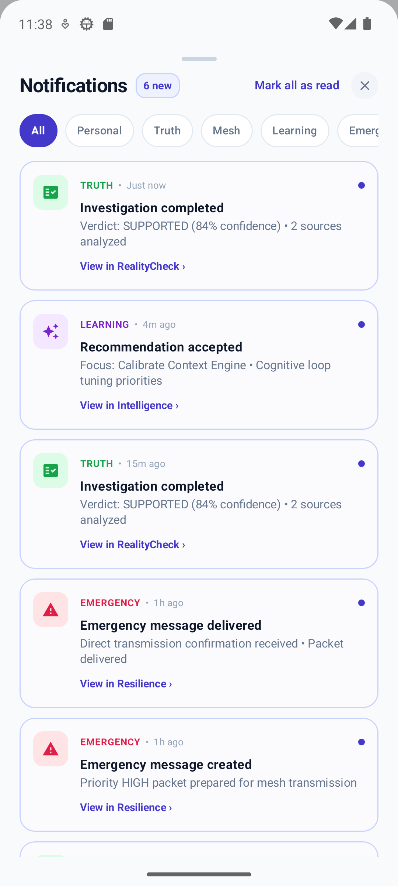 | 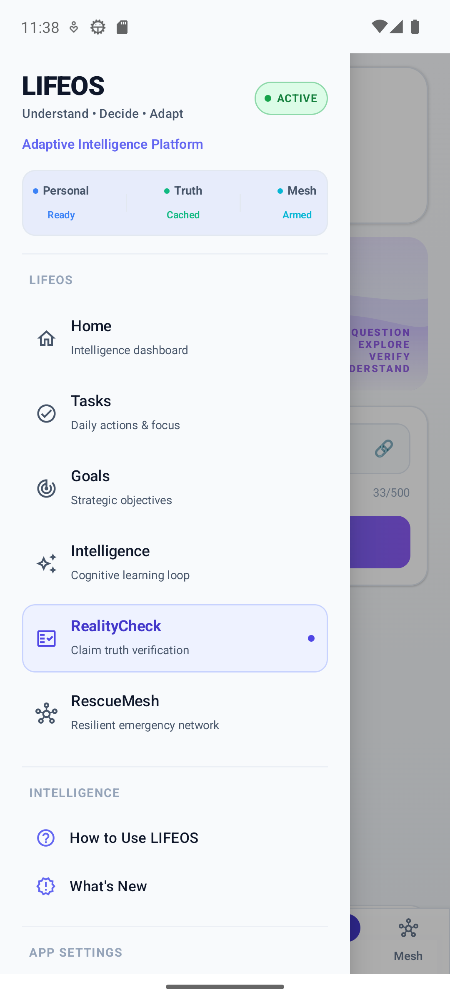 |
| **Notification Center**<br/>Multi-category audit trail (`Personal`, `Truth`, `Mesh`, `Learning`, `Emergency`), timestamped verification outcomes, and direct unread badge synchronization. | **Adaptive Navigation Drawer**<br/>Global system menu with real-time subsystem health status badges (`Personal Ready`, `Truth Cached`, `Mesh Armed`), quick jumps, and app configuration. |

| 13. Appearance & Theme Engine | 14. Midnight Navy Dark Mode |
| :---: | :---: |
| 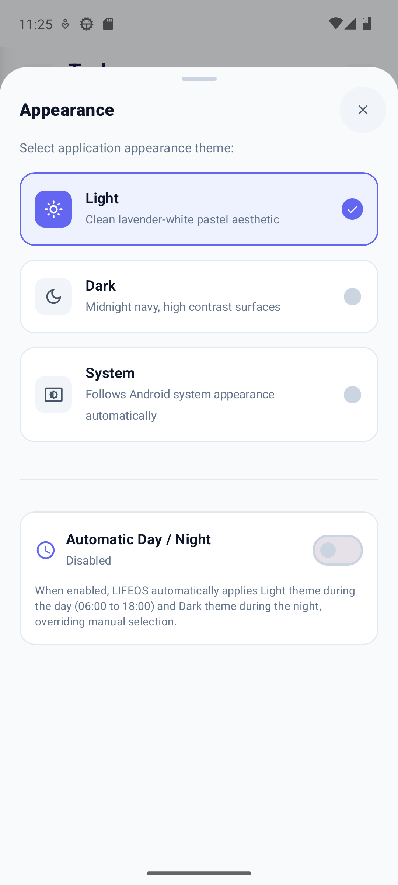 | 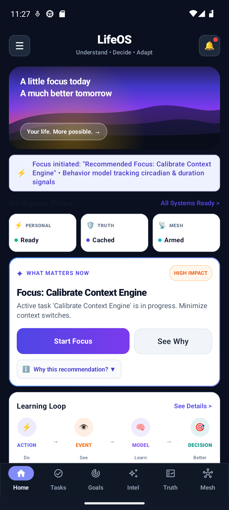 |
| **Theme Customizer**<br/>Granular appearance controls: Light Lavender-White Pastel, High-Contrast Midnight Navy, System Default, or Automatic Circadian Day/Night switching (06:00–18:00). | **Midnight Navy Command Center**<br/>Deep `#07152F` midnight OLED-optimized dark mode, engineered for minimal eye fatigue and high visibility during emergency nighttime operations. |

---

## 🏛️ System Architecture

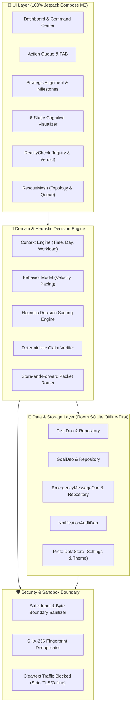

---

## ⚡ The Three Intelligence Pillars

### 1. Personal Intelligence: Explainable Heuristic Decision Engine

Unlike generative AI assistants that hallucinate or require server round-trips, LIFEOS uses a deterministic heuristic engine that factors in:
- **Urgency & Deadlines ($U$)**: Time remaining relative to current timestamp.
- **Circadian Rhythm Fit ($C$)**: Calibrated to individual peak focus windows (Morning, Afternoon, Evening).
- **Behavioral Momentum ($M$)**: Historical category completion rates and current task streaks.
- **Fatigue & Workload Penalty ($F$)**: Continuous workload monitoring preventing cognitive burnout.

$$\text{Priority Score} = \omega_u \cdot U + \omega_c \cdot C + \omega_m \cdot M - \omega_f \cdot F$$

#### Continuous 6-Stage Cognitive Lifecycle:
```
  [01 OBSERVE] ────► [02 UNDERSTAND] ────► [03 DECIDE]
       ▲                                         │
       │                                         ▼
  [06 ADAPT]   ◄──── [05 MEASURE]    ◄────   [04 ACT]
```

- **Observe**: Passively senses device context (time of day, network state, task backlog).
- **Understand**: Models velocity and completion patterns without sending raw telemetry off-device.
- **Decide**: Computes transparent priority scoring with an explicit **"Why this recommendation?"** rationale.
- **Act**: Empowers single-tap focus sessions, time tracking, and frictionless task execution.
- **Measure**: Records completion timestamps, postponement signals, and focus duration.
- **Adapt**: Dynamically tunes heuristic weights for future recommendations.

---

### 2. Trust Intelligence: RealityCheck Engine

In an age of rampant misinformation, RealityCheck acts as an on-device truth verification hub:
- **Claim Normalization**: Parses user inputs, stripping bias markers and extracting verifiable factual propositions.
- **Hierarchical Domain Corpus**: Matches assertions against verified ground-truth knowledge bases:
  - *Tier 1 (Official / Government)*: NASA, WHO, NOAA, National Weather Service.
  - *Tier 2 (Academic / Peer-Reviewed)*: PubMed, Nature, arXiv, academic encyclopedias.
  - *Tier 3 (Authoritative Reference)*: Encyclopaedia Britannica, historical reference registries.
- **Deterministic Consensus Calculation**:
  - Compares corroborating vs. contradicting sources.
  - Calculates transparent confidence metrics (e.g. $84\%$ confidence based on 2 verified institutional sources with $100\%$ consensus).
  - Emits clear, auditable verdicts: `SUPPORTED`, `CONTRADICTED`, `MIXED`, or `INSUFFICIENT_EVIDENCE`.

---

### 3. Resilience Intelligence: RescueMesh Protocol

Designed for disaster scenarios, network blackouts, or remote excursions where cellular towers fail:
- **Decentralized Store-and-Forward**: Messages are stored locally in Room SQLite and opportunistically forwarded to peers upon local radio contact.
- **Cryptographic Fingerprint Deduplication**:
  $$\text{Fingerprint} = \text{SHA-256}(\text{senderId} \parallel \text{payload} \parallel \text{timestamp} \parallel \text{ttl} \parallel \text{hops})$$
  Ensures identical packets are never processed or rebroadcast twice across the mesh.
- **Bounded-Hop Propagation (`maxHops = 5`)**: Prevents broadcast storms and infinite routing loops in high-density peer topologies.
- **Strict Triage & TTL Expiration**:
  - `CRITICAL`: 48-Hour TTL with immediate front-of-queue priority.
  - `URGENT` / `HIGH`: 24-Hour TTL.
  - `NORMAL`: 12-Hour TTL.
  - Background sweeps automatically purge expired packets to prevent storage exhaustion.
- **Opportunistic Gateway Synchronization**: As soon as any node in the cluster reaches Wi-Fi or cellular connectivity, all unacknowledged queue items are safely relayed to emergency dispatch endpoints.

---

## 🔒 Security & Privacy Hardening

LIFEOS has been audited and hardened according to rigorous zero-trust mobile security standards:

| Security Vector | Implementation Detail | Status |
| :--- | :--- | :---: |
| **Zero Cloud Leaks** | No remote telemetry, analytics, crash reporters, or external tracking SDKs. | ✅ ENFORCED |
| **Network Security** | `android:usesCleartextTraffic="false"` strictly disallows insecure HTTP communication. | ✅ ENFORCED |
| **Component Exposure** | All internal Activities, Receivers, and ContentProviders marked `android:exported="false"`. | ✅ ENFORCED |
| **Payload Clamping** | Emergency SOS text strictly capped at 256 bytes; Truth queries capped at 500 characters. | ✅ ENFORCED |
| **Injection Defense** | Pure Room SQLite parameterized queries and input sanitizers eliminating SQL/script injections. | ✅ ENFORCED |
| **Cryptographic Integrity** | Deterministic SHA-256 hashing for all packet deduplication and state verification. | ✅ ENFORCED |

---

## 🧪 Comprehensive Verification & Test Suite

The LIFEOS codebase is validated by a rigorous, automated unit test suite covering domain use cases, heuristic decision algorithms, truth verification pipelines, and cryptographic mesh logic.

```bash
# Execute the complete unit test suite (153 tests)
.\gradlew.bat testDebugUnitTest
```

### Test Results Summary:
```
============================================================
Gradle Test Run :app:testDebugUnitTest
153 tests, 0 failures, 0 skipped
SUCCESS RATE: 100%
TEST DURATION: 5.99s
============================================================
```

#### Test Suite Breakdown:
- **`com.mrashish18.lifeos.domain.usecase`**: Complete coverage of `TaskUseCases`, `EmergencyUseCases`, and `PerformRealityCheckUseCase`.
- **`com.mrashish18.lifeos.domain.engine`**: Comprehensive validation of the `DecisionEngine` weighting formulas, circadian rhythm calibrations, and fatigue thresholds.
- **`com.mrashish18.lifeos.domain.resilience`**: Thorough testing of `RescueMeshEngine`, SHA-256 fingerprint calculations, hop-decrement rules, and TTL expirations.
- **`com.mrashish18.lifeos.feature.*`**: ViewModel state verification testing UI event streams, state reductions, and flow emissions.
- **`com.mrashish18.lifeos.security`**: Boundary security tests verifying input sanitation, length clamping, and malicious input handling.

---

## 🚀 Quick Start & Build Instructions

### Prerequisites
- **Android Studio**: Hedgehog / Iguana / Jellyfish (or latest Canary)
- **JDK**: Java 17+
- **Android SDK**: Platform 34 (Android 14) with Build Tools `34.0.0`
- **Device / Emulator**: Android 8.0+ (API 26+) — Recommended: Pixel 6/7/8 running API 33/34.

### Build and Run

```bash
# 1. Clone the repository
git clone https://github.com/mrashish18/LIFEOS.git
cd LIFEOS

# 2. Run the test suite
.\gradlew.bat testDebugUnitTest

# 3. Assemble the Debug APK
.\gradlew.bat assembleDebug

# 4. Install onto connected Android device or emulator
.\gradlew.bat installDebug

# 5. Launch the application
adb shell am start -n com.mrashish18.lifeos/.MainActivity
```

---

## 🎨 Design System & Accessibility

LIFEOS features an adaptive design system built on **Material Design 3**:
- **Adaptive Contrast**: High-contrast typography and color ratios compliant with WCAG 2.1 AA accessibility guidelines.
- **Canvas Artistry**: High-performance, hardware-accelerated Jetpack Compose Canvas graphics for mountain sunrises, winding trails, and signal wave topologies.
- **Haptic Feedback**: Meaningful tactile sensations for task completions, priority toggles, and emergency transmissions.
- **Theme Parity**: Seamless real-time transition between Light Lavender-White Pastel and High-Contrast Midnight Navy, with zero UI flicker or layout displacement.

---

## 📄 License & Attribution

```
Copyright 2026 Ashish / mrashish18.
Licensed under the Apache License, Version 2.0 (the "License");
you may not use this file except in compliance with the License.
You may obtain a copy of the License at

    http://www.apache.org/licenses/LICENSE-2.0
```

<div align="center">
  <sub>Engineered with precision for resilience, intentionality, and human autonomy.</sub>
</div>
