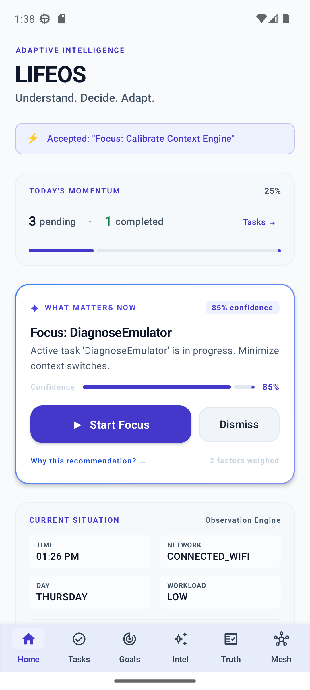
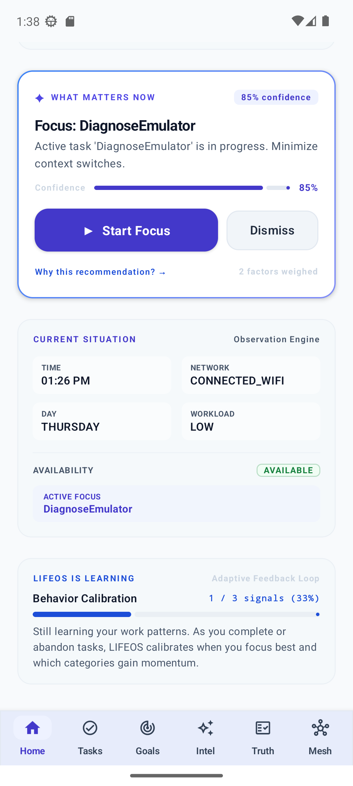
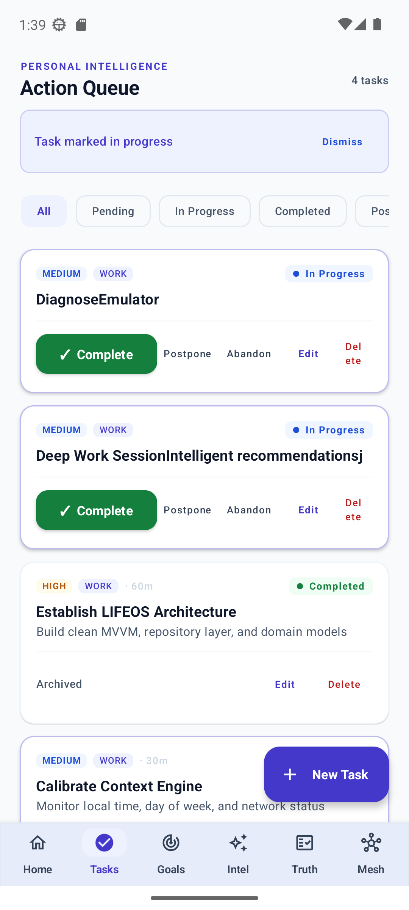
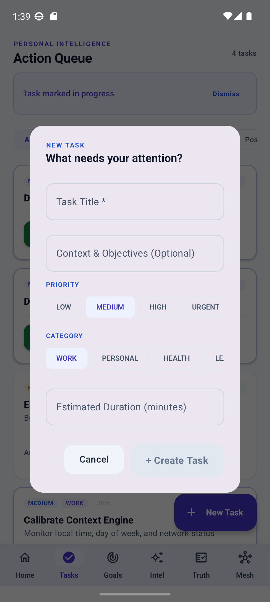
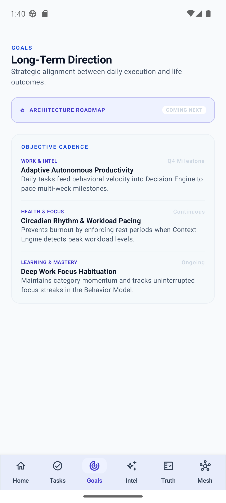
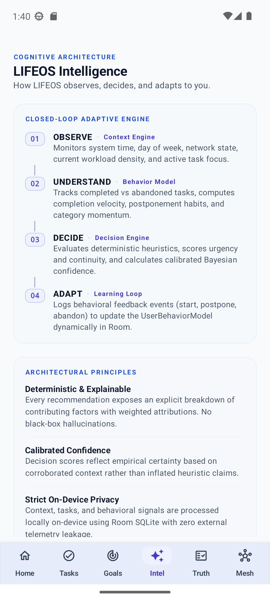
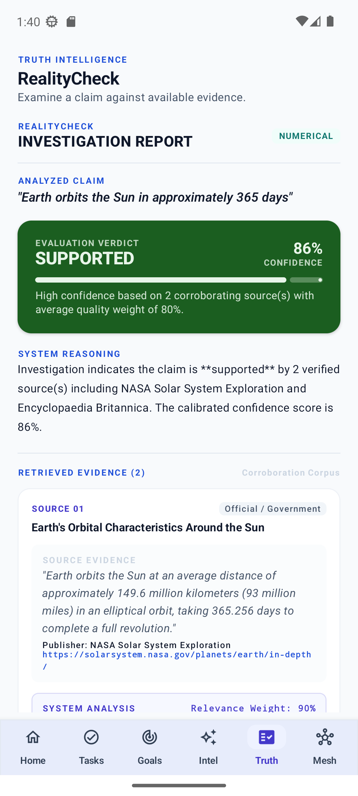
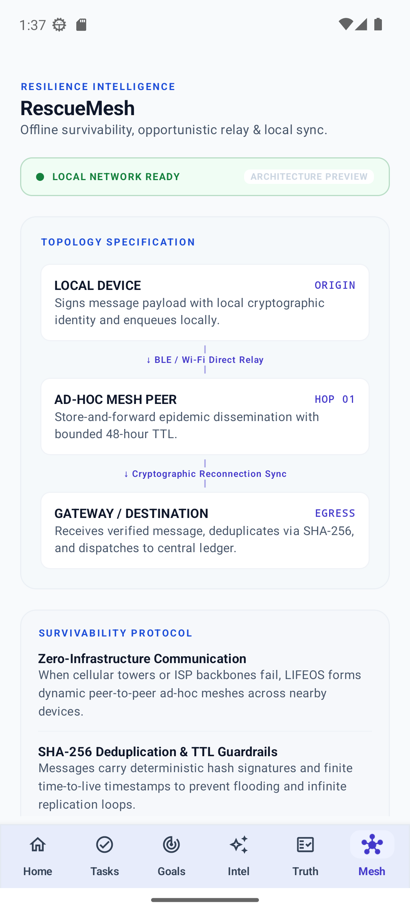

# LIFEOS

> **Understand. Decide. Adapt.**  
> An adaptive personal intelligence platform for Android.

---

## Overview

LIFEOS is an on-device personal intelligence system designed to observe situational context, make explainable decisions, calibrate to individual behavior patterns, and operate with zero cloud reliance. Built on pure Jetpack Compose, Kotlin Coroutines, and Room SQLite, LIFEOS represents a departure from generic to-do lists and black-box AI assistants.

---

## Visual Showcase

| 01. Command Center | 02. Adaptive Learning |
| :---: | :---: |
|  |  |
| **Command Center Dashboard**<br/>Live telemetry, momentum meter, and centerpiece recommendation. | **Closed-Loop Learning**<br/>Bayesian behavior calibration tracking completion habits. |

| 03. Personal Intelligence | 04. Task Authoring |
| :---: | :---: |
|  |  |
| **Action Queue**<br/>Prioritized, category-tagged tasks with state filters. | **Creation Sheet**<br/>Bottom sheet editor for priority, duration, and categories. |

| 05. Strategic Goals | 06. Cognitive Architecture |
| :---: | :---: |
|  |  |
| **Long-Term Direction**<br/>Multi-week milestone alignment and pacing. | **System Architecture**<br/>Four-stage Observe-Understand-Decide-Adapt pipeline. |

| 07. Trust Intelligence | 08. Resilience Intelligence |
| :---: | :---: |
|  |  |
| **RealityCheck**<br/>Multi-source corroboration and evidence analysis. | **RescueMesh**<br/>Zero-infrastructure peer-to-peer survivability protocol. |

---

## Core Pillars

### 1. Personal Intelligence
- **Persistent Action Queue**: Backed by Room SQLite with full offline durability.
- **Explainable Decision Engine**: Heuristically weights urgency, continuity, and availability without generative hallucinations.
- **Adaptive Learning Loop**: Captures explicit user signals (start, complete, abandon, postpone) to continuously calibrate completion velocities and category momentum.

### 2. Trust Intelligence (RealityCheck)
- **Claim Analysis**: Extracts factual assertions from user text inputs and URLs.
- **Corroboration Engine**: Matches claims against trusted domain corpora (Government, Academic, Established Reference).
- **Calibrated Scoring**: Produces explainable verification verdicts (`SUPPORTED`, `CONTRADICTED`, `MIXED EVIDENCE`) with explicit source weighting.

### 3. Resilience Intelligence (RescueMesh)
- **Zero-Infrastructure Communication**: Architectural blueprint for opportunistic peer-to-peer message relay across local devices.
- **Integrity Guardrails**: Enforces SHA-256 cryptographic message hashing to eliminate duplicate packets and bounded TTL to prevent infinite relay loops.

---

## Architecture

```
                       ┌──────────────────────┐
                       │    Context Engine    │
                       │ (Time, Net, Workload)│
                       └──────────┬───────────┘
                                  │
                                  ▼
                       ┌──────────────────────┐
                       │    Decision Engine   │
                       │(Explainable Decision)│
                       └──────────┬───────────┘
                                  │
         ┌────────────────────────┼────────────────────────┐
         ▼                        ▼                        ▼
┌──────────────────┐    ┌──────────────────┐    ┌──────────────────┐
│     Personal     │    │ Trust (Reality)  │    │Resilience (Mesh) │
│   Intelligence   │    │   Intelligence   │    │   Intelligence   │
└────────┬─────────┘    └──────────────────┘    └──────────────────┘
         │
         ▼
┌──────────────────┐
│  Learning Loop   │
│ (Behavior Model) │
└──────────────────┘
```

---

## Design System

- **Colors**: Deep intelligent navy (`#0F172A`), electric indigo accents (`#4338CA`), cool slate neutrals, and semantic state indicators.
- **Typography**: Clean hierarchy featuring uppercase letterspaced eyebrows, bold headlines, and monospaced telemetry values.
- **Components**: Tactile 50dp primary action buttons, 2x2 responsive telemetry grids, custom elevated bottom navigation bar with active pill containers, and open divider-based list rows.
- **Safety & Clearance**: Strict bottom bar window insets and `100.dp` content clearance to guarantee zero clipping or overlap across all device form factors.

---

## Build & Test

### Run Unit Tests
```bash
.\gradlew.bat testDebugUnitTest
```

### Build Debug APK
```bash
.\gradlew.bat assembleDebug
```

### Install to Connected Device / Emulator
```bash
.\gradlew.bat installDebug
adb shell am start -n com.mrashish18.lifeos/.MainActivity
```
